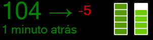
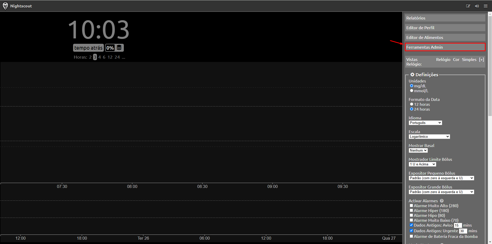
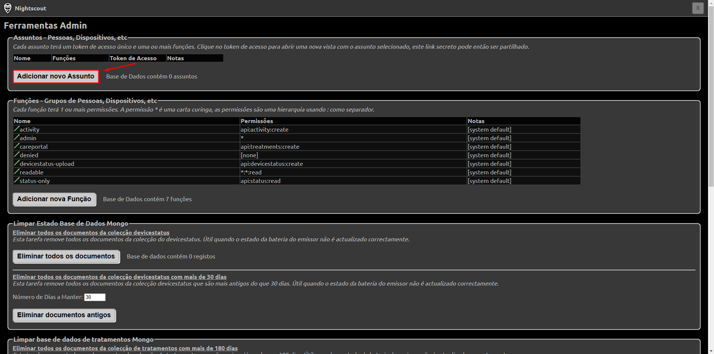
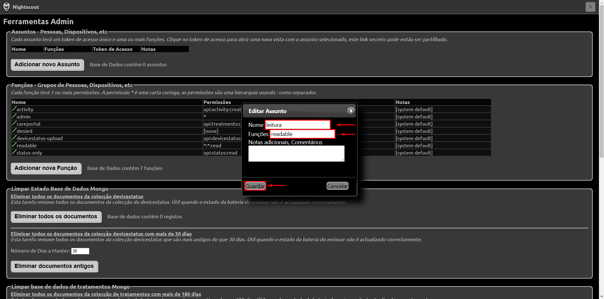
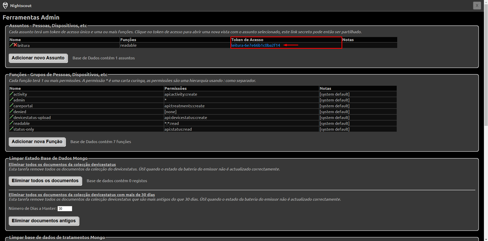
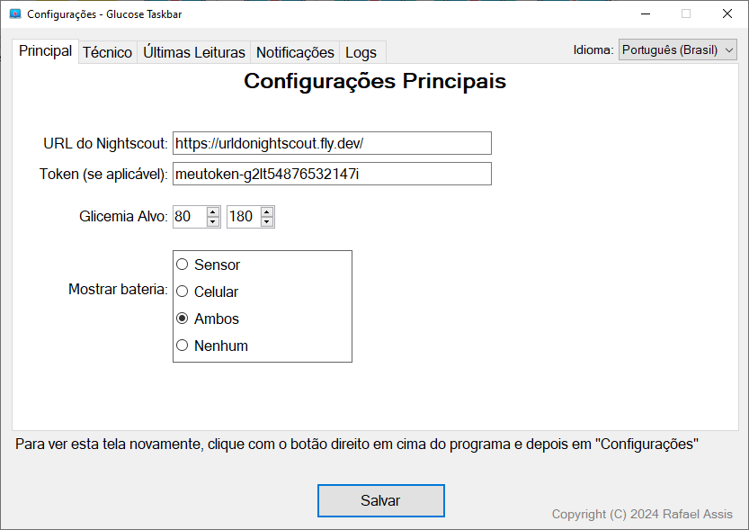

# Glucose Taskbar 

For an English version of this README, click on the following icon: 

## O que é Glucose Taskbar?

**Glucose Taskbar** é um programa criado por Rafael Assis que tem o objetivo de fornecer um espelho da glicemia no Windows, próximo à barra de tarefas ou em cima dela, através da API do Nightscout. É um programa que teve como inspiração o [Floating Glucose](https://github.com/dabear/FloatingGlucose), mas como o Floating Glucose deixou de oferecer suporte (foi arquivado) e eu necessitava de funcionalidades adicionais mais específicas para meu uso (inclusive tradução para o meu idioma, português), resolvi criar o meu próprio e disponibilizar o código, o que me permitiu treinar habilidades de programação.

Atualmente, possui tradução para dois idiomas em todas as escritas: português (PT-BR) e inglês (EN-US).

Possui uma [interface principal básica](#interface-principal-básica) contendo a leitura atual da glicemia, seta de tendência, delta e tempo da última leitura, juntamente com um ou dois displays de bateria (sensor e celular), de acordo com a opção do usuário. 

Possui também uma [página de configurações](#página-de-configurações) onde é possível fazer algumas personalizações de acordo com suas preferências.

Aceita tokens de autenticação do Nightscout e, até o momento, **foi testado apenas com Freestyle Libre 1 + MiaoMiao 2 + xDrip** devido à eu, Rafael, não possuir em mãos outros dispositivos e softwares como Bubble (Nano, Mini), Suggah, Smart AiDEX etc. para fazer testes e adaptar conforme necessário.

## Instalação

Para utilizar o Glucose Taskbar, é necessário baixar a última versão do programa localizada em Releases e executar o arquivo .exe. Para obter o link direto, [clique aqui](link_para_releases).

## Como usar

A usabilidade do Glucose Taskbar é bem simples, basta inserir a **URL do seu Nightscout**, um token **com permissão de leitura** (se necessário, criado lá na parte "Ferramentas de administração" do Nightscout) e salvar. Opcionalmente, há configurações extras que podem ser feitas, como: Glicemia alvo, transparência, tamanho do programa, forçar entrada na barra de tarefas etc.

Ao clicar com o botão **direito do mouse** em cima do programa, mais opções serão mostradas, inclusive a opção **Configurações**, que exibe todas as configurações que podem ser feitas no programa.

### Como obter um token no Nightscout?

Se o seu Nightscout estiver seguro contra bisbilhoteiros, ele provavelmente não permitirá acessar os valores da glicemia sem um token. Para obter um token com permissão de leitura, siga os passos abaixo:

Clicar em **"Ferramentas Admin"**.

Clicar em **"Adicionar novo Assunto"**.

Em "Nome", digitar qualquer nome que represente este token. Em "Funções", digitar o valor **"readable"** (sem aspas) e clicar em **"Guardar"**.

Copiar o valor gerado no campo **"Token de Acesso"**. Este será seu token para que possa inserir no aplicativo. Por favor, **NÃO COMPARTILHE COM TERCEIROS**.

## Interface principal básica

A interface é composta de: valor da glicemia, seta de tendência, delta, horário da última atualização e amostragem de bateria do MiaoMiao e celular (opcinais, personalizáveis nas configurações). Por padrão, fica sobreposto à maioria dos programas, mas há ainda uma opção nas Configurações que permite a entrada na barra de tarefas e força o programa a permanecer sempre na frente da tela, o que faz com que a maioria dos jogos continuem exibindo a glicemia, mesmo em tela cheia. Ao clicar com o botão direito em cima desta tela, há um menu com diversas opções, incluindo abrir as configurações, mover para uma determinada posição da tela e sair do programa.

## Página de Configurações

A página de configurações é composta por: Principal, Técnico, Últimas Leituras (em breve), Notificações (em breve) e Logs. Segue abaixo um resumo de como funciona cada item desta tela:

### Principal
<table>
  <tr>
    <th>Campo</th>
    <th>Explicação</th>
  </tr>
  <tr>
    <td>URL do Nightscout</td>
    <td>URL (site) utilizada para acessar o Nightscout.</td>
  </tr>
  <tr>
    <td>Token (se aplicável)</td>
    <td>Token com permissão de leitura ou leitura e escrita, utilizado para autenticação em Nightscouts protegidos.</td>
  </tr>
  <tr>
    <td>Glicemia Alvo</td>
    <td>Valor mínimo e máximo da glicemia alvo, para que o programa exiba a cor da glicemia de acordo com este alvo (sendo verde dentro do alvo e amarelo fora do alvo).</td>
  </tr>
  <tr>
    <td>Mostrar bateria</td>
    <td>Mostrará a bateria do MiaoMiao e/ou celular na interface principal.</td>
  </tr>
</table>
 

### Técnico
<table>
  <tr>
    <th>Campo</th>
    <th>Explicação</th>
  </tr>
  <tr>
    <td>Intervalo de Atualização</td>
    <td>Intervalo de tempo (em segundos) em que o programa se baseará para fazer a busca dos dados. Observação: Esse tempo se refere à busca dos valores no Nightscout, ou seja, isso NÃO indica que sua glicemia será lida nesse intervalo pelo sensor (essa responsabilidade é do sensor e do transmissor).</td>
  </tr>
  <tr>
    <td>Transparência</td>
    <td>Valor de transparência do programa, permitindo que seja possível visualizar o que há atrás dele de acordo com o valor estabelecido.</td>
  </tr>
  <tr>
    <td>Tamanho do programa</td>
    <td>Escala que indica o tamanho da interface principal do programa, podendo ser aumentada ou diminuída.</td>
  </tr>
  <tr>
    <td>Forçar programa sempre na frente e permitir a entrada na barra de tarefas</td>
    <td>Essa opção (ainda experimental) faz com que o programa fique sempre na frente da maioria dos demais programas, incluindo jogos em tela cheia e permite que ele entre na barra de tarefas. Pode consumir um pouquinho a mais de recursos em computadores mais fracos, mas é muito útil em quem precisa monitorar constantemente a glicemia.</td>
  </tr>
<tr>
    <td>Acelerar a busca de dados se a glicemia mudar rapidamente</td>
    <td>Altera a busca de dados para 10 segundos se a glicemia subir ou cair rapidamente em vez do tempo definido em "Intervalo de Atualização". Observação: Esse tempo se refere à busca dos valores no Nightscout, ou seja, isso NÃO indica que sua glicemia será lida nesse intervalo pelo sensor (essa responsabilidade é do sensor e do transmissor).</td>
  </tr>
<tr>
    <td>Abrir na Inicialização do Windows</td>
    <td>Inicia o programa junto com o Windows.</td>
  </tr>
</table>
 

### Últimas Leituras

Funcionalidade ainda em desenvolvimento.

### Notificações

Funcionalidade ainda em desenvolvimento.

### Logs

Permite observar os logs que o programa emite e salvar para anexar em uma Issue (ver [problemas](#problemas)).

## Próximos passos

Como próximos passos, os já citados seção de **"últimas leituras"** (contendo as 10 últimas leituras da glicemia em um gráfico), **"notificações"** (por exemplo, alertando bateria baixa ou sensor prestes a expirar) e **alarmes**. Quem desejar contribuir com essas funcionalidades, ler a seção de [contribuições](#contribuições).

## Contribuições

Há 2 formas principais de contribuir:
- Desenvolvedores podem solicitar Pull Requests de melhorias e, se eu considerar adequado, posso incluir no repositório.
- Se você não for um desenvolvedor, não se preocupe, sua contribuição será muito bem vinda também! Se você utiliza sensor AiDEX, transmissores Bubble (Mini e Nano), Suggah ou qualquer outra combinação que seja diferente de **Freestyle Libre 1 + MiaoMiao 2 + xDrip**, pode me ajudar fornecendo dados para que eu possa adequar o meu programa para essas plataformas. Em resumo, vou precisar do link do Nightscout e um token com permissão de leitura apenas, token este que pode (e deve) ser removido nas configurações do Nightscout assim que os testes forem concluídos.

## Problemas

Em caso de falhas técnicas, abrir uma Issue descrevendo o problema, exportar o conteúdo dos logs no botão "Salvar logs" e anexar na Issue aberta. Não esquecer também de inserir prints (screenshots) e o máximo de informações que conseguir. Se você precisar incluir informações confidenciais (como tokens ou a URL do seu Nightscout), por favor, **NÃO as insira aqui**. Em vez disso, entre em contato diretamente em rafael.developer150@gmail.com.

## Privacidade e Segurança de Dados

Este programa foi desenvolvido com a privacidade dos usuários como prioridade. Nenhuma informação pessoal, dados de uso ou configurações são enviados ou compartilhados com servidores externos, serviços de terceiros ou outros dispositivos. Todos os dados do usuário são mantidos localmente, exclusivamente no ambiente onde o programa é executado.

A segurança e a confidencialidade dos dados são essenciais, e recomendamos que os usuários mantenham o programa atualizado para assegurar a proteção contínua contra possíveis vulnerabilidades.

## Licença

Distribuído sob a licença [GPL-3.0](./LICENSE), garantindo que este projeto permanecerá gratuito e de código aberto.