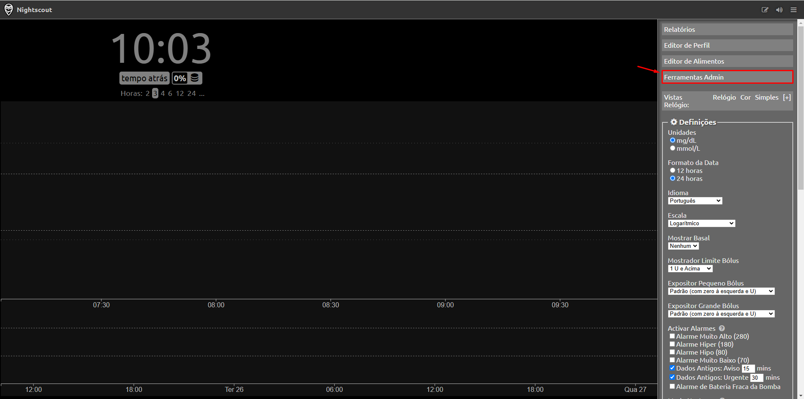
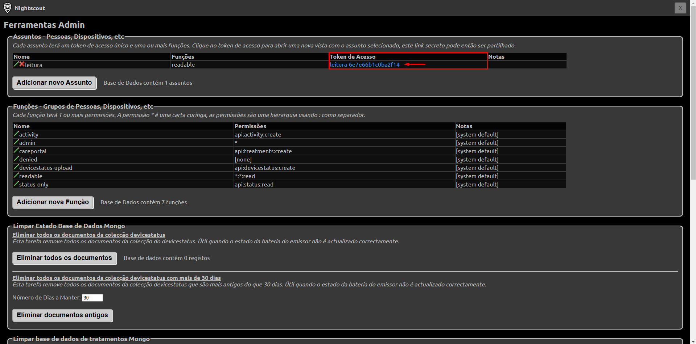

# Glucose Taskbar 

Para uma versão deste README em português, clique no seguinte ícone: 

## What is Glucose Taskbar?

**Glucose Taskbar** is a program created by Rafael Assis to provide a mirror of blood glucose readings on Windows, next to or on top of the taskbar, using the Nightscout API. It was inspired by [Floating Glucose](https://github.com/dabear/FloatingGlucose), but since Floating Glucose ceased support (archived), and I needed additional functionalities specific to my use (including translation to my language, Portuguese), I decided to create my own program and make the code available, which allowed me to practice programming skills.

Currently, it supports translation for two languages: Portuguese (PT-BR) and English (EN-US).

It has a [basic main interface](#basic-main-interface) displaying the current blood glucose reading, trend arrow, delta, and last reading time, along with one or two battery displays (sensor and phone), according to user preference.

It also includes a [settings page](#settings-page) where some customizations can be made according to your preferences.

It accepts Nightscout authentication tokens and, so far, **has only been tested with Freestyle Libre 1 + MiaoMiao 2 + xDrip** since I, Rafael, do not have access to other devices and software such as Bubble (Nano, Mini), Suggah, Smart AiDEX, etc., for testing and adapting as needed.

## Installation

To use Glucose Taskbar, download the latest version of the program available in Releases and run the .exe file. For a direct link, [click here](https://github.com/RafaelBomfim128/GlucoseTaskbar/releases).

### Windows SmartScreen Warning

Windows may display a warning when running the Glucose Taskbar installer because it is not digitally signed. This occurs due to the high cost of digital certificates, which is not feasible for an open-source project like this.

**If the warning appears**, follow these steps:

1. Click on **"Mais Informações"** in the warning.
2. Click on **"Executar assim mesmo"**.

We emphasize that the source code is publicly available on GitHub, ensuring complete transparency.

## How to Use

Using Glucose Taskbar is simple. Just enter your **Nightscout URL**, a **read permission token** (if required, created in the "Admin Tools" section in Nightscout), and save. Optionally, there are extra settings that can be configured, such as Target Glucose, transparency, program size, force entry to taskbar, etc.

By **right-clicking** on the program, more options will appear, including the **Settings** option, which displays all the settings that can be configured in the program.

### How to Get a Token in Nightscout?

If your Nightscout is secure against intruders, it likely won't allow access to blood glucose values without a token. To obtain a token with read permissions, follow the steps below:

Click on **"Admin Tools"**.

Click on **"Add new Subject"**.

In "Name," type any name to represent this token. In "Roles," type **"readable"** (without quotes) and click **"Save"**.

Copy the value generated in the **"Access Token"** field. This will be your token to input into the application. Please, **DO NOT SHARE IT WITH THIRD PARTIES**.

## Basic Main Interface

The interface consists of: blood glucose value, trend arrow, delta, last update time, and optional customizable battery display for MiaoMiao and phone (configurable in settings). By default, it overlays most programs, but there is also an option in Settings that allows it to enter the taskbar and forces the program to stay on top, which makes it so that most games continue to display blood glucose even in fullscreen mode. Right-clicking on this screen brings up a menu with several options, including opening settings, moving to a specific screen position, and exiting the program.

## Settings Page

The settings page consists of: Main, Technical, Latest Readings (coming soon), Notifications (coming soon), and Logs. Below is a summary of how each item on this screen works:

### Main
<table>
  <tr>
    <th>Field</th>
    <th>Description</th>
  </tr>
  <tr>
    <td>Nightscout URL</td>
    <td>The URL (website) used to access Nightscout.</td>
  </tr>
  <tr>
    <td>Token (if applicable)</td>
    <td>Token with read or read and write permission, used to authenticate in protected Nightscout instances.</td>
  </tr>
  <tr>
    <td>Target Glucose</td>
    <td>Minimum and maximum target glucose values, so that the program displays glucose color according to this target (green within target and yellow outside target).</td>
  </tr>
  <tr>
    <td>Show Battery</td>
    <td>Displays MiaoMiao and/or phone battery on the main interface.</td>
  </tr>
</table>
 

### Technical
<table>
  <tr>
    <th>Field</th>
    <th>Description</th>
  </tr>
  <tr>
    <td>Data refresh interval</td>
    <td>Time interval (in seconds) for the program to fetch data. Note: This time refers to fetching values from Nightscout, which DOES NOT mean that your blood glucose will be read at this interval by the sensor (this is the responsibility of the sensor and transmitter).</td>
  </tr>
  <tr>
    <td>Transparency</td>
    <td>Program transparency level, allowing you to see what's behind it according to the set value.</td>
  </tr>
  <tr>
    <td>Program size</td>
    <td>Scale indicating the size of the program's main interface, adjustable to increase or decrease.</td>
  </tr>
  <tr>
    <td>Force program always on top and allow entry into the taskbar</td>
    <td>This option (still experimental) keeps the program always on top of most other programs, including fullscreen games, and allows it to enter the taskbar. It may consume slightly more resources on weaker computers but is very useful for those who need constant glucose monitoring.</td>
  </tr>
<tr>
    <td>Accelerate data fetch if glucose changes rapidly</td>
    <td>Changes the data fetch rate to 10 seconds if glucose rises or falls quickly instead of the time defined in "Update Interval". Note: This time refers to fetching values from Nightscout, which DOES NOT mean that your blood glucose will be read at this interval by the sensor (this is the responsibility of the sensor and transmitter).</td>
  </tr>
<tr>
    <td>Open at Windows Startup</td>
    <td>Launches the program with Windows.</td>
  </tr>
</table>
 

### Latest Readings

Feature under development.

### Notifications

Feature under development.

### Logs

Allows viewing the logs emitted by the program and saving them to attach to an Issue (see [issues](#issues)).

## Next Steps

Next steps include the already mentioned **"latest readings"** section (showing the last 10 glucose readings in a graph), **"notifications"** (for example, alerting of low battery or sensor expiration), and **alarms**. If you'd like to contribute to these features, see the [contributions](#contributions) section.

## Contributions

There are 2 main ways to contribute:
- Developers can submit Pull Requests for improvements, and if I find them appropriate, I may include them in the repository.
- If you're not a developer, don't worry; your contribution is also welcome! If you use an AiDEX sensor, Bubble transmitters (Mini and Nano), Suggah, or any other combination different from **Freestyle Libre 1 + MiaoMiao 2 + xDrip**, you can help by providing data so I can adjust my program for these platforms. In short, I'll need your Nightscout link and a read-only token, which should (and can) be removed from Nightscout settings once testing is complete.

## Issues

For technical issues, open an Issue describing the problem, export the log content by clicking "Save logs", and attach it to the opened Issue. Also, remember to include screenshots and as much information as possible. If you need to include confidential information (such as tokens or your Nightscout URL), please **DO NOT insert it here**. Instead, contact me directly at rafael.developer150@gmail.com.

## Privacy and Data Security

This program was developed with user privacy as a priority. No personal information, usage data, or settings are sent or shared with external servers, third-party services, or other devices. All user data is stored locally, exclusively on the environment where the program runs.

The security and confidentiality of data are essential, and we recommend users keep the program up-to-date to ensure continuous protection against possible vulnerabilities.

## License

Distributed under the [GPL-3.0](./LICENSE) license, ensuring that this project remains free and open-source.
